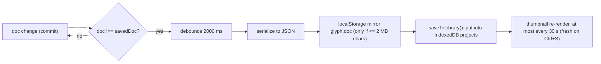

# Data model

The editor has one spine of data: the engine `Doc`, optionally carrying a scene tree; the
zustand store holding the live `Doc` plus UI/tool state; and IndexedDB persistence holding
library entries that the store autosaves into. This doc walks that spine bottom-up.

## The `Doc` ([`src/engine/core/doc.ts`](../../src/engine/core/doc.ts))

```mermaid
erDiagram
    Doc ||--|o SceneLayer : "layers (scene docs)"
    Doc ||--|| PixelStyle : style
    Doc ||--|| TextureSettings : texture
    Doc ||--|| MetaballSettings : metaball
    Doc ||--o{ ElementStyle : elements
    SceneLayer ||--o{ SceneItem : children
    SceneGroup ||--o{ SceneItem : children
    SceneObj ||--o| Graph : graph
    SceneObj ||--o{ Link : links
```

Key fields (see `doc.ts` for the full interface; sizes clamp to `MAX_SIZE = 4096` and
`cells.length ≤ MAX_CELLS = 16_777_216` — `fitSub` steps the sub-detail down when the product
would exceed the cell budget):

| Field | Type | Meaning |
|---|---|---|
| `gridType` | `square \| hex \| triangle \| radial \| diamond \| iso \| brick \| octasquare` | lattice; sub-cells, corner connectivity, selection transforms are square-only features |
| `cols`, `rows`, `sub` | `number` | grid size; buffers are `cols·sub × rows·sub` |
| `cells` | `Uint16Array` | flat ink buffer; `0` = empty, `v ≥ 1` → `palette[v-1]` |
| `cellObj` | `Uint32Array \| null` | owning element id per buffer cell (`0` = unattributed; `null` = attribution never used) |
| `links` | `Link[]` | connectors between cell centers, 1-based palette value, optional element attribution |
| `palette` | `string[]` | hex colors; **derived** on scene docs (base palette + graph-referenced hexes) |
| `style` | `PixelStyle` | cell appearance: radius, per-corner overrides, sizeX/Y, cell form, tone size… |
| `renderMode` | `'pixels' \| 'outline' \| 'metaball'` | render mode |
| `connectivity` | `'edge' \| 'corner' \| 'corner-bridge'` | how diagonal cells join in outline/metaball modes |
| `styleScope` | `'global' \| 'element'` | whether styles apply canvas-wide or are frozen per element |
| `elements` | `ElementStyle[]` | frozen style snapshots; element id *n* lives at index *n−1* |
| `layers` | `SceneLayer[] \| null` | **`null` = legacy flat document** whose ink lives directly in the buffers |
| `nextNodeId` | `number` | monotonic scene-node id counter |
| `bg`, `connectorWidth`, `fuseObjects`, `gridRotation`, `radialEven` | misc | background, connector stroke width, element fusion, render-time-only grid rotation |

## Two document regimes

1. **Flat (legacy)** — `layers === null`: the buffers are the source of truth. Global-scope
   documents stay flat forever; `ensureScene` (`scene-resize.ts`) only converts element-scope
   docs to the tree.
2. **Scene tree** — `layers` set: a Photoshop-style tree of `SceneLayer`/`SceneGroup`/
   `SceneObj` nodes (tree order = bottom → top). The object's `cells` (`Map<index, value>`),
   `links`, `style` and optional `graph` are the source of truth; the flat `cells`/`cellObj`/
   `links`/`elements`/`palette` on `Doc` become **derived** — recomputed by `syncDoc(doc)`
   (`scene.ts`), cached in a `WeakMap` keyed by the layers-array *identity* plus a
   `gridType|cols|rows|sub|palette` fingerprint. All tree mutations are immutable for this
   reason; writing to the derived buffers of a scene doc is meaningless.

A scene object with a `graph` is procedural: its ink and appearance are **evaluated** from the
node graph at composite time (`evalGraphMemo`); stored ink acts only as the implicit first
input for graphs without source nodes (see [node-graph](../modules/node-graph.md)).

**Element styles.** In element scope every stroke freezes a style snapshot
(`elementFromDoc`) into `elements`; `sameElementStyle` (deep equality) decides which
neighboring elements render as one merged group (`fuseObjects: false` disables the merge for
Illustrator-style stacking). Unattributed ink (id 0) renders as a bottom group with doc-level
style — nothing ever disappears.

## Store (`src/state/`)

One zustand store, composed from 16 slices (each owns its initial state + actions; the store
file owns composition, undo wiring and side effects):

`ui · tools · doc · style · paint · fill · selection · transform · effect · glyph · gradient ·
vector · vector-presets · presets · brushes · project`

Undo history (zundo `temporal` middleware) is scoped by `partialize` to `{ doc }` only —
UI/tool/library state is not undoable. Restoring a history entry is a **whole-`Doc`
replacement** (root-shaped partialize), throttled at 350 ms trailing so slider drags collapse
into one step; the step limit is dynamic (see below). Because selection ids and the active
layer id live outside the history, `repairDocRefs` (`store.effects.ts`) filters them against
the restored doc after every undo/redo/load.

Module-level subscription effects (`setupStoreEffects`) react to state deltas — there is no
action bus:

1. `syncHistoryLimit` — undo entries hold whole cell buffers, so the step limit is recomputed
   per doc size to stay inside a ~256 MB history budget (min 2, max 100 steps).
2. Theme mirror — `<html data-theme>` + `prefers-color-scheme` listener for `auto`.
3. Pixel autosave — debounced 2 s; see below.
4. Dirty flag — `projectDirty` when the doc differs from the saved snapshot.

## Persistence (`src/storage/`)

IndexedDB `glyph-editor`, version 7, one connection; every store degrades to an in-memory
`Map` when IndexedDB is unavailable.

| Object store | Entry | Notes |
|---|---|---|
| `projects` | `ProjectEntry` (`id` keyPath, `by_updated` index) | typed: `pixel \| vector \| gradient` |
| `presets` | `PresetEntry` — named editor-config snapshots | normalized on every read/write |
| `brushes` | `BrushPresetEntry` — tip + captured working color | |
| `glyphTiles` | `GlyphTileSetEntry` — user tile ramps | |
| `vectorPresets` | trace-param presets | |
| `autosave`, `vectorJobs` | legacy slots | only touched by the v7 migration and `migrate.ts` |

**Project entries.** Pixel entries embed a serialized `ProjectJSON` (`v: 3` — scene docs
serialize the tree only; flat docs write `cells`, `elements`, RLE `cellObj`). Vector/gradient
entries carry the source raster (`{width, height, data: ArrayBuffer}`, rejected above 4096²),
params, the produced SVG and stats. `deserialize`/`normalizeProject` are fully defensive:
clamps, enum whitelists, legacy-field rewrites; a record too broken to open is filtered out
rather than crashing the gallery.

**Autosave flow (pixel projects):**



Unbound work (no library entry yet) gets a fresh entry on the first flush. Vector/gradient
sessions sit outside undo history and persist with their own 1.5 s throttle. `pagehide` /
`visibilitychange` flush immediately. One-time migration (`migrate.ts`, runs before the first
route) adopts a pre-home-session draft from the localStorage mirror (fallback: legacy IDB
`autosave['current']`) into a bound pixel entry, guarded by the `glyph.migratedV7` marker.

## Serialization guards worth knowing

- `cellObj` serializes RLE (`[id, runLength, …]`); scene-object cells serialize as plain
  `[index, value, …]` pairs — two different encodings.
- Buffer length on parse is `max(cols·sub·rows·sub, grid cell count)` — the octasquare's gap
  squares make the lattice bigger than the rectangle.
- The composite cache key includes a palette fingerprint; palette edits must produce a new
  layers array + fingerprint or the cache serves stale buffers.
- Demo projects are ordinary library entries with stable `demo.`-prefixed ids: opening a demo
  twice re-opens the existing entry instead of overwriting it (user renames survive).

See [storage](../modules/storage.md) for the full persistence contract and
[state-store](../modules/state-store.md) for slice-by-slice responsibilities.
