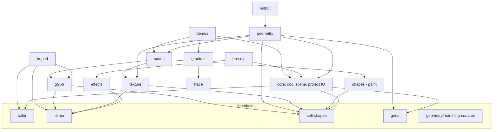

# Engine map — the `src/engine/` index

The engine is the pure-TypeScript domain layer: document model, geometry, rasterization, color,
dithering, import/export. It imports nothing from `state/`, `storage/`, `features/`, `shared/` or
`app/` (enforced by the `engine-is-pure` dependency-cruiser rule; the only exception is
`engine/*.test.ts`, which may lift the store for integration scenarios —
[ADR-0001](../decisions/0001-pure-ts-engine-layer.md)).

Every domain lives in one folder under `src/engine/`. The root holds only two engine-level test
infrastructure files: [`bench-doc.util.ts`](../../src/engine/bench-doc.util.ts) (shared bench
fixtures) and [`perf-stress.test.ts`](../../src/engine/perf-stress.test.ts) (the PERFLOG
regression ratchets). Naming: a family's public facade is the folder's `index.ts`; the other files
in the folder carry short, prefix-free names because the folder already provides the context.

## Folder tree

| Folder | Responsibility | Public entry |
|---|---|---|
| [`core/`](../../src/engine/core/) | Document model (`Doc`, styles, symmetry state), scene tree, resize/sub-detail, project (de)serialization, size presets, stage themes, scrollbar metrics | [`doc.ts`](../../src/engine/core/doc.ts), [`scene.ts`](../../src/engine/core/scene.ts), [`project.ts`](../../src/engine/core/project.ts) |
| [`color/`](../../src/engine/color/) | RGB/HSV/CMYK conversions, tone scales, palette presets + import/export | [`index.ts`](../../src/engine/color/index.ts), [`color.ts`](../../src/engine/color/color.ts) |
| [`cell-shapes/`](../../src/engine/cell-shapes/) | Registry of ~28 cell forms (square/dot/star/gear…), unit polygons, hit-testing, SVG fragments per placed cell | [`index.ts`](../../src/engine/cell-shapes/index.ts) |
| [`grids/`](../../src/engine/grids/) | Grid catalog (square/hex/triangle/radial/diamond/iso/brick…), lattice builders, rotated/polar projections, per-grid cell geometry | [`index.ts`](../../src/engine/grids/index.ts) |
| [`shapes/`](../../src/engine/shapes/) | Vector shape tool: 22 parametric generators, rasterization to cells, even-odd fill classification | [`index.ts`](../../src/engine/shapes/index.ts), [`fill.ts`](../../src/engine/shapes/fill.ts) |
| [`paint/`](../../src/engine/paint/) | Brush tips and flood fill/region extraction | [`brush.ts`](../../src/engine/paint/brush.ts), [`floodfill.ts`](../../src/engine/paint/floodfill.ts) |
| [`effects/`](../../src/engine/effects/) | Ink transforms: symmetry (mirror/radial/wallpaper repeats), warp fields, per-cell jitter, selection transforms, post-ops (outline/shadow/glow) | [`symmetry.ts`](../../src/engine/effects/symmetry.ts), [`stylize.ts`](../../src/engine/effects/stylize.ts) |
| [`geometry/`](../../src/engine/geometry/) | The render pipeline core: `buildGeometry` per render mode (pixels/outline/metaball), RLE run merging, marching squares, styled paths | [`index.ts`](../../src/engine/geometry/index.ts) |
| [`texture/`](../../src/engine/texture/) | Vector textures carved into fills (grain/grunge/halftone/hatch) + fill-tool patterns & dithered gradients | [`index.ts`](../../src/engine/texture/index.ts), [`fill.ts`](../../src/engine/texture/fill.ts) |
| [`dither/`](../../src/engine/dither/) | Ordered-dither matrices, threshold fields, blue noise, scan orders, halftone screen engine, screen-line hatch systems | [`matrices.ts`](../../src/engine/dither/matrices.ts), [`catalog.ts`](../../src/engine/dither/catalog.ts) |
| [`glyph/`](../../src/engine/glyph/) | Glyph tile sets (character-density dithering), procedural generators, bitmap font, ASCII raster | [`builtins.ts`](../../src/engine/glyph/builtins.ts), [`tiles.ts`](../../src/engine/glyph/tiles.ts) |
| [`import/`](../../src/engine/import/) | Raster image import: fit → quantize → dither mapping (ordered/diffusion/special) → post effects | [`index.ts`](../../src/engine/import/index.ts) |
| [`output/`](../../src/engine/output/) | PNG thumbnails, SVG export, ASCII export | [`png.ts`](../../src/engine/output/png.ts), [`svg.ts`](../../src/engine/output/svg.ts) |
| [`presets/`](../../src/engine/presets/) | Editor presets (forms/retro/studio/textures) assembled from seeded docs | [`index.ts`](../../src/engine/presets/index.ts) |
| [`demos/`](../../src/engine/demos/) | 20+ demo projects as pure `ProjectJSON` factories (landing art, home screen) | [`index.ts`](../../src/engine/demos/index.ts) |
| [`nodes/`](../../src/engine/nodes/) | Procedural node graph: 11 node families, registry, evaluation with memoization | [`index.ts`](../../src/engine/nodes/index.ts) |
| [`gradient/`](../../src/engine/gradient/) | Gradient fitting for vector workspaces: stop-color fitting, linear/radial solvers, layered composites | [`pipeline.ts`](../../src/engine/gradient/pipeline.ts) |
| [`trace/`](../../src/engine/trace/) | Raster → SVG vectorizer (vtracer port): quantize → contours → curve fitting → mosaic | [`trace.ts`](../../src/engine/trace/trace.ts) |

## Dependency flow

Arrows point from consumer to dependency. The engine is a strict DAG at domain level, anchored on
`core/` (the document) and `color/`; `demos/` sits on top of everything and is consumed only by the
landing art script and the projects feature.

Known quirks (documented, not yet fixed):

- `core/doc.ts` and `core/scene.ts` are mutually referential at the type level (`SceneLayer` in
  `Doc.layers`; `Doc` in scene signatures). There is no runtime cycle.
- `texture/field.ts` ⇄ `texture/hatch.ts` form a real value-level cycle inside the texture folder
  (`fieldSolid` ↔ `hatchFieldFragments`). ESM handles it via hoisting; it predates the folder split
  and is confined to one folder.
- `core/doc.ts` imports `docSize` (a value) from `grids/`, while everything grids-internal refers
  back to `core/doc` type-only — the grids family stays a clean DAG.

## Module docs

| Domain | Doc page | Start here |
|---|---|---|
| Document & scene | [doc-and-scene](../modules/doc-and-scene.md) | [`core/doc.ts`](../../src/engine/core/doc.ts) — the `Doc` model everything reads |
| Render pipeline | [geometry](../modules/geometry.md) + [render-pipeline](render-pipeline.md) | [`geometry/index.ts`](../../src/engine/geometry/index.ts) — `buildGeometry` |
| Canvas surface | [canvas-stage](../modules/canvas-stage.md) | `features/canvas/` (UI side of the pipeline) |
| Grids & cell forms | [grids](../modules/grids.md) | [`grids/index.ts`](../../src/engine/grids/index.ts) |
| Shape tool | [shapes](../modules/shapes.md) | [`shapes/index.ts`](../../src/engine/shapes/index.ts) |
| Brush & flood fill | [paint-tools](../modules/paint-tools.md) | [`paint/brush.ts`](../../src/engine/paint/brush.ts) |
| Symmetry, warp, stylize | [effects](../modules/effects.md) + [symmetry](../modules/symmetry.md) | [`effects/symmetry.ts`](../../src/engine/effects/symmetry.ts) |
| Textures (how a texture is drawn) | [texture](../modules/texture.md) | [`texture/region.ts`](../../src/engine/texture/region.ts) |
| Fill patterns & dithered gradients | [dither-and-patterns](../modules/dither-and-patterns.md) | [`texture/fill.ts`](../../src/engine/texture/fill.ts) |
| Dither matrices & screens | [dither-and-patterns](../modules/dither-and-patterns.md) | [`dither/matrices.ts`](../../src/engine/dither/matrices.ts) |
| Glyph dithering & text | [glyphs](../modules/glyphs.md) | [`glyph/tiles.ts`](../../src/engine/glyph/tiles.ts) |
| Image import | [image-import](../modules/image-import.md) | [`import/index.ts`](../../src/engine/import/index.ts) — `convertImage` |
| Palettes & presets | [palettes-and-presets](../modules/palettes-and-presets.md) | [`color/index.ts`](../../src/engine/color/index.ts) |
| PNG/SVG/ASCII output | [render-outputs](../modules/render-outputs.md) | [`output/png.ts`](../../src/engine/output/png.ts) |
| Node graph | [node-graph](../modules/node-graph.md) | [`nodes/index.ts`](../../src/engine/nodes/index.ts) |
| Gradient workspace engine | [gradient-workspace](../modules/gradient-workspace.md) | [`gradient/pipeline.ts`](../../src/engine/gradient/pipeline.ts) |
| Vectorizer | [vectorizer](../modules/vectorizer.md) | [`trace/trace.ts`](../../src/engine/trace/trace.ts) |
| Demo projects | [projects-and-demos](../modules/projects-and-demos.md) | [`demos/index.ts`](../../src/engine/demos/index.ts) |
