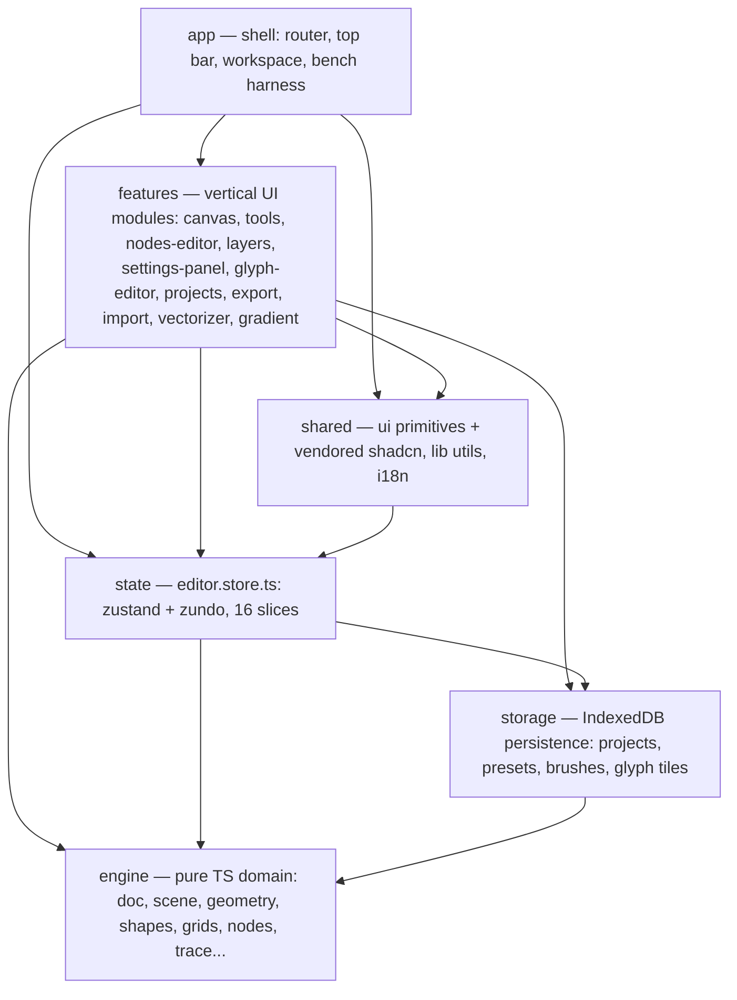

# Architecture overview

Ditherlab is a single-page web editor (React 19 + TypeScript + Vite) with three project kinds
that share one app shell: **pixel** projects (cell grids rendered as vector paths), and two
raster-to-vector workspaces — **vector** (image → traced SVG) and **gradient**
(image → fitted SVG gradients). The core principle of the pixel editor is a single geometry
pipeline: `buildGeometry(doc) → StyledPath[]` feeds canvas preview, PNG export and SVG export
alike, so the vector output is exactly what the preview shows (see
[render-pipeline.md](render-pipeline.md)).

## Layers

Five layers, enforced by dependency-cruiser (`.dependency-cruiser.cjs`), not by convention:

| Rule | Meaning |
|---|---|
| `engine` imports nothing above itself (`engine-is-pure`) | No React, no DOM, no store access. Exception: `engine/*.test.ts` may lift the store for integration scenarios. |
| `storage → engine` only (`storage-only-engine`) | Persistence serializes engine types; it never imports UI or state. |
| `state → engine + storage` (`state-no-ui`) | The store owns document state and library bindings; it never imports UI layers. |
| `features → { shared, engine, state, storage }` | Features consume the store and the persistence API freely; they must not import each other (`features-no-cross-imports`). |
| No feature → feature imports | Shared code goes up to `shared/`. Single documented exception: `settings-panel` assembles the right column out of `layers` and `nodes-editor`. |

## Engine module map

The engine (`src/engine/`) is the whole domain: document model, geometry, rasterization,
import/export math, the procedural node graph, and the two tracing pipelines. All of it runs
in plain TypeScript in any JS runtime — that is what makes node-side vitest benches
(`npm run bench`) representative of the shipped code.

| Subsystem | Files | Module doc |
|---|---|---|
| Document + scene tree | `doc.ts`, `doc-style.ts`, `scene.ts`, `scene-legacy.ts`, `scene-resize.ts`, `project*.ts` | [doc-and-scene](../modules/doc-and-scene.md) |
| Geometry build | `geometry*.ts`, `geometry-metaball.ts` | [geometry](../modules/geometry.md) |
| Render outputs | `png.ts`, `svg.ts`, `outline.ts`, `marching-squares.ts`, `poly-path.ts` | [render-outputs](../modules/render-outputs.md) |
| Shapes | `shapes.ts` + `shape-*.ts`, `shapefill.ts` | [shapes](../modules/shapes.md) |
| Paint tools | `brush.ts`, `floodfill.ts` | [paint-tools](../modules/paint-tools.md) |
| Grids | `grids.ts`, `grids-*.ts`, `grid-*.ts`, `cell-shape-*.ts` | [grids](../modules/grids.md) |
| Symmetry | `symmetry.ts`, `symmetry-radial.ts`, `symmetry-repeat.ts` | [symmetry](../modules/symmetry.md) |
| Effects | `warp.ts`, `stylize.ts`, `selection-xform.ts` | [effects](../modules/effects.md) |
| Texture | `texture*.ts` | [texture](../modules/texture.md) |
| Dither + patterns | `dither-matrices.ts`, `fillpatterns*.ts` | [dither-and-patterns](../modules/dither-and-patterns.md) |
| Image import | `import-*.ts` (facade + 10 stage modules) | [image-import](../modules/image-import.md) |
| Node graph | `nodes/` (engine), `features/nodes-editor/` (UI) | [node-graph](../modules/node-graph.md) |
| Vectorizer | `trace/` (engine), `features/vectorizer/` (UI) | [vectorizer](../modules/vectorizer.md) |
| Gradient workspace | `gradient/` (engine), `features/gradient/` (UI) | [gradient-workspace](../modules/gradient-workspace.md) |
| Glyph tiles | `glyph-*.ts`, `features/glyph-editor/` | [glyphs](../modules/glyphs.md) |
| Palettes + presets | `palettes*.ts`, `palette-io.ts`, `presets*.ts` | [palettes-and-presets](../modules/palettes-and-presets.md) |
| Misc utilities | `image-ops.ts`, `color.ts`, `scrollbars.ts`, `sizes.ts`, `stage-themes.ts`, `demo-*.ts` | covered by their subsystem docs |

## Platform layers in brief

- **state** — one zustand store (`state/editor.store.ts`) composed of 16 slices, zundo undo
  history scoped to `{ doc }`, and module-level subscription effects (autosave, history
  budget, theme mirror). See [state-store](../modules/state-store.md) and
  [data-model.md](data-model.md).
- **storage** — IndexedDB database `glyph-editor` (schema v7) with typed object stores and a
  debounced ambient autosave. See [storage](../modules/storage.md).
- **features** — vertical UI modules. The two heavyweights are `canvas` (the render surface
  and all pointer interaction, [canvas-stage](../modules/canvas-stage.md)) and the coupled
  engine+feature pairs listed above.
- **app** — TanStack Router routes (`/` home, `/p/$projectId` workspace), top bar, hotkeys,
  i18n (EN/RU typed dictionaries), seven themes. See [app-shell](../modules/app-shell.md).
- **shared** — project UI primitives (`Chip`, `Slider`, `ConfirmDialog`, …) over vendored
  shadcn/ui, `lib/` utilities, i18n providers.

## Concurrency

Two production Web Workers (request-id + transferable-`ArrayBuffer` protocol), one per
raster-to-vector workspace: `features/vectorizer/trace.worker.ts` and
`features/gradient/gradient.worker.ts`. Everything else — geometry rebuilds, dithering,
autosave serialization — is main-thread by design, with costs tracked in
`bench/PERFLOG.md` ([research/performance.md](../research/performance.md) sizes what is worth
offloading). There is no WASM in the production bundle (see
[ADR-0003](../decisions/0003-rust-wasm-policy.md)).

## Toolchain

| Command | Role |
|---|---|
| `npm run dev` / `build` | Vite dev server; `build` = `tsc --noEmit` + Vite bundle |
| `npm run lint` / `lint:ai` | oxlint gate (0 errors; warnings advisory) |
| `npm run format` / `format:check` | oxfmt (100 cols, 2 spaces, no semicolons, sorted imports/Tailwind) |
| `npm run arch:check` | dependency-cruiser layer boundaries (table above) |
| `npm run knip` | dead exports/files/dependencies gate |
| `npm test` | vitest unit tests (colocated `*.test.ts`) |
| `npm run bench` | vitest engine benches → `bench/results/engine-bench.json` |
| `?bench=1&autorun=1` | browser harness driving the real store + CanvasStage (see [app-shell](../modules/app-shell.md)) |

TypeScript runs with `strict`, `verbatimModuleSyntax`, `noUnusedLocals/Parameters`, and
index-signature access rules; several checks (lint categories, size ratchets per file,
commit-lint) are documented in `AGENTS.md`.

## Behavior truth

Requirements and scenarios live in OpenSpec (`openspec/specs/` for the 13 current capability
specs, `openspec/changes/` for in-flight work and the archive). The division of labor between
that tree and this one is defined in [ADR-0007](../decisions/0007-openspec-docs-boundary.md).
