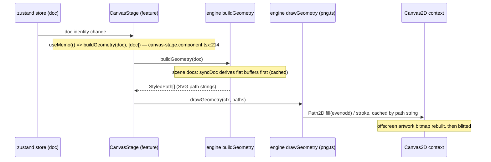
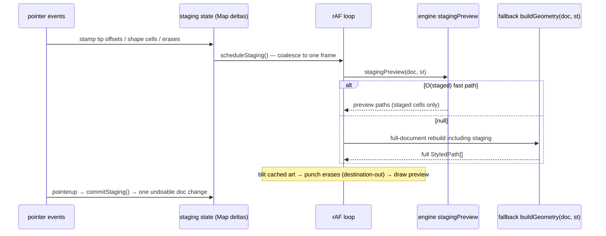

# Render pipeline

Everything the user sees on the pixel canvas — and everything exported — comes from one
geometry pipeline. This doc follows a pixel from a store dispatch to painted pixels, then
covers the in-stroke staging loop and the per-mode costs.

## Committed pipeline

`buildGeometry(doc)` (`src/engine/geometry.ts`) dispatches in order:

1. Scene docs → `sceneGeometry`: per visible layer, bottom → top, filling one pair of reused
   scratch buffers (each layer's paths are built before the next layer starts), merging staged
   ink/erases into the owning layers, then running the same builders on a scoped doc.
   Invariant: metaball fields and outlines never fuse across layers.
2. Element scope → `elementGeometry`: group buffer cells by owning element, merge groups whose
   frozen styles are equal (cached style key), render each group with its own virtual doc.
3. Non-square grids (and rotated squares) → `gridBuildGeometry` — the generic lattice path.
4. `metaball` → metaball field + marching squares; `outline` → binary-field silhouette +
   fillets; otherwise `shapeGeometry` (rectangles/fragments per cell run).

**The RLE fast path.** Plain pixel geometry (all radii 0, `sizeX/Y = 1`, square shape without
rotation, no texture, no tone sizing) merges horizontal runs of same-value cells into single
rect fragments — orders of magnitude fewer path fragments for classic pixel art
(PERFLOG M2a: `buildGeometry` −39 %…−99 % depending on content). Anything else goes per-cell.

**Consumption.** `drawGeometry` (`engine/png.ts`) fills with `fill(path, 'evenodd')` — the
fill rule is load-bearing (texture holes, outline bridge overlays and metaball loops rely on
it). `Path2D`s are cached by the path *string* with a 32 M-char FIFO budget: geometry rebuilds
produce identical strings, so equal strings are the same path by construction. The SVG
exporter (`engine/svg.ts`) serializes the same `StyledPath[]` to flat `<path>` elements with
`fill-rule="evenodd"`; PNG rasterization (`renderPng`) scales the same geometry onto a canvas
(capped at 5000 px/side).

## In-stroke staging (no React renders)

During a stroke the stage bypasses React entirely
(`features/canvas/use-canvas-staging.hook.ts`):

`stagingPreview` (`geometry.ts:144–260`) costs O(staged cells) and returns **null** — forcing
the full-document fallback — whenever the staged delta cannot be previewed in isolation:

- no staged cells;
- the doc is not a plain square grid (non-square lattices and rotated grids reshape content
  outside the staged set);
- connector links were added/removed (count changed);
- the style in play is not "usable": render mode must be `pixels` and texture `none` —
  this applies per element in element scope, and doc-level in global scope.

The last rule is the **stroke-fallback cliff**: outline, metaball-with-texture and textured
documents rebuild the whole document geometry on every rAF frame of a stroke. Measured costs
(`render-modes.bench.ts`, 512², 5 % ink): pixels 5.8 ms, metaball 4.7 ms, triangle grid
9.4 ms, outline 36.3 ms — and outline at 2048² costs 722 ms, grain texture ≈ 1.7 s per frame
(working-tree measurement, `docs/research/performance.md` §5). Mitigations and the tile-model
plan are tracked in `bench/PERFLOG.md` and the research doc's roadmap.

## Overlay layer

A second, pointer-transparent canvas draws symmetry guides, the selection marching ants
(rAF loop with a 60 s dash-phase wrap, active only while a selection exists), transform box,
marquee, hover brush ghost. Square-grid line overlays are prebuilt `Path2D`s (a 500×500 grid
is ~3000 segments per direction — too costly to rebuild per frame); non-square grids rebuild
their overlay path per doc change. The grid only strokes at zoom ≥ 4.

## Where the costs live (2026-09-30 checkpoint)

| Operation | Cost | Lever |
|---|---|---|
| Commit 4096² (browser) | 116–190 ms | tile data model (per-tile geometry, PERFLOG M1 target) |
| Whole-canvas geometry rebuild, 2048² | 233 ms vs 6.3 ms for 4 dirty tiles | tile model (37×, `tile-spike.bench.ts`) |
| Node drag tick (pos inside `Graph`) | 687 ms engine / ~1.7 s browser | split `pos` out of `Graph` (P0) |
| Graph eval 4096² | 651 ms | typed-array `Cells` (P3) |
| Zoom/pan wheel step | 2.5–4.9 ms | not a bottleneck (demoted) |

Full findings, methodology and the prioritized roadmap:
[research/performance.md](../research/performance.md); the change-by-change log with the
gating rules: `bench/PERFLOG.md`.
