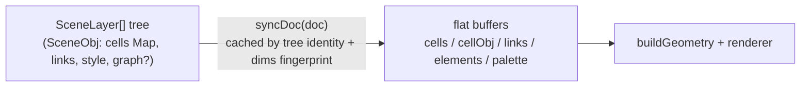

# Document & scene — technical notes

## Scope

The document model of the pixel editor: the `Doc` type and its buffers
(`src/engine/doc.ts`), the optional Photoshop-style scene tree (`src/engine/scene.ts`),
style snapshots (`doc-style.ts`), tree operations (`scene-resize.ts`, `scene-legacy.ts`) and
project serialization (`project.ts`, `project-json.ts`, `project-parse.ts`). Everything above
rendering and below the store. Not covered here: how geometry is built from a doc
([geometry](geometry.md)) or how the store holds the doc ([state-store](state-store.md)).

## Module map

| File | Role |
|---|---|
| `src/engine/doc.ts` | `Doc` interface, size constants (`MAX_SIZE=4096`, `MAX_CELLS=16_777_216`), `fitSub`, `resizeDoc`, `changeSub`, `defaultDoc`, `resolveColor` |
| `src/engine/doc-style.ts` | `elementFromDoc` (frozen style snapshot), `sameElementStyle` (merge rule), scope transitions |
| `src/engine/scene.ts` | scene tree types, node helpers, `syncDoc` + composite cache, `buildComposite` |
| `src/engine/scene-legacy.ts` | `sceneFromLegacy` — flat doc → one-layer tree migration |
| `src/engine/scene-resize.ts` | pure tree ops: resize/sub/grid conversion, `updateNode`, `stealCells`, group/ungroup, reorder, `pruneEmptyObjs` |
| `src/engine/project-json.ts` / `project-parse.ts` / `project.ts` | `ProjectJSON v: 3`, defensive parse, public `serialize`/`deserialize` |

## How it works

A `Doc` carries flat buffers (`cells: Uint16Array`, `cellObj`, `links`) plus **either** legacy
ownership of those buffers (`layers === null`) **or** a scene tree that *derives* them:

`syncDoc(doc)` returns flat docs unchanged. For scene docs it rebuilds the composite in two
passes — derive the palette (deduped doc palette + every graph's `graphColors` hexes), then
paint visible objects bottom → top (graph objects via `evalGraphMemo`) — into
`cells`/`cellObj`/`links`/`elements`. The result is cached in a `WeakMap` keyed by the
layers-array identity plus the fingerprint
`` `${gridType}|${cols}|${rows}|${sub}|${palette.join(',')} `` — which is why **every tree
mutation is immutable** (`updateNode` clones the root array) and palette edits must produce a
new array.

Serialization mirrors the regimes: scene docs write only the tree (`links: []`, no
`cells`/`elements`); flat docs write `cells`, `elements` and RLE `cellObj`
(`[id, runLength, …]`). Parsing (`deserializeInternal`) is fully defensive — clamps, enum
whitelists, legacy rewrites (`texture.size` → sizeMin/sizeMax, `metaball.enabled` →
`renderMode: 'metaball'`) — and auto-migrates element-scope v2 docs through `sceneFromLegacy`.
Global-scope documents stay flat on purpose ("their layers UI shows the scope hint").

## Data structures

- `SceneObj { id, name, visible, locked, style: ElementStyle, cells: Map<number, number>,
  links: Link[], graph? }` — sparse ink; a present `graph` makes ink/appearance *evaluated*
  (stored cells are the implicit first input only for graphs without source nodes).
- `SceneGroup`/`SceneLayer` — containers; tree order is bottom → top; the outermost group is
  the select-tool click unit; `nodeProtected` treats locked/hidden ancestors as protected.
- Element ids are **1-based**: element *n* lives at `elements[n-1]`; `cellObj` value 0 =
  unattributed; the staging sentinel `PENDING_OBJ = 0xffff_ffff` marks stroke-in-flight cells.
- `ProjectJSON { v: 3, … }` — see `project-json.ts`; buffer length on parse is
  `max(cols·sub·rows·sub, grid cell count)` (octasquare gap squares exceed the rectangle).

## Invariants & constraints

- `layers === null` vs `[]` is a *semantic* difference: null = flat; set = derived buffers.
- The derived `palette` on scene docs includes graph hexes — it is not the user's base list.
- Within a layer, a cell has exactly one owner (`stealCells` paint-over rule).
- `pruneEmptyObjs` never drops objects owning a graph node.
- `resizeDoc` preserves content anchored top-left; `changeSub` (nearest-neighbor resample) is
  square-grid-only.
- Undo budget note: whole buffers per history step — see [state-store](state-store.md).

## Performance characteristics

- The composite cache makes style-only edits cheap (fingerprint unchanged) but *any* tree
  mutation invalidates; full composite rebuild at 2048² is ~4.2 ms (`tile-spike.bench.ts`).
- Buffer caps: `MAX_CELLS = 16_777_216` ≈ 96 MB of live buffers per composite rebuild
  (`doc.ts`).
- Benches: `scene.bench.ts`, `persistence.bench.ts`; tests: `scene.test.ts`,
  `demo-project.test.ts`.

## Related decisions

- [ADR-0005](../decisions/0005-zustand-single-store.md) — whole-doc undo restore is why the
  composite cache and immutable tree ops matter.
- [ADR-0006](../decisions/0006-indexeddb-persistence.md) — `ProjectJSON v: 3` is what storage
  persists.

## OpenSpec capabilities

- `openspec/specs/persistence/spec.md` (project save/load)
- `openspec/specs/canvas-grid/spec.md` (grid/sub-doc behavior)

## Known limitations

- No partial/projected loads: `deserialize` is a full parse; revisited with the tile model
  (`docs/research/performance.md` §9).
- Element ids are dense array indices; deleting an element style relies on re-attribution
  rather than tombstones.
