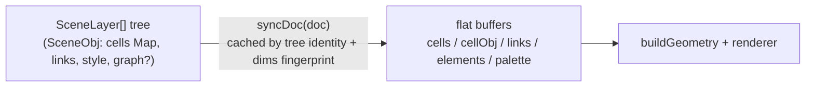

# Document & scene — technical notes

## Scope

The document model of the pixel editor, in [`src/engine/core/`](../../src/engine/core/): the `Doc`
type and its buffers ([`src/engine/core/doc.ts`](../../src/engine/core/doc.ts)), buffer resize and sub-detail
resampling ([`src/engine/core/doc-resize.ts`](../../src/engine/core/doc-resize.ts)), the optional Photoshop-style
scene tree ([`src/engine/core/scene.ts`](../../src/engine/core/scene.ts)) with its pure tree ops and legacy
migration, style snapshots ([`src/engine/core/doc-style.ts`](../../src/engine/core/doc-style.ts)), stage
themes ([`src/engine/core/stage-themes.ts`](../../src/engine/core/stage-themes.ts)), project serialization
([`src/engine/core/project.ts`](../../src/engine/core/project.ts) + `project-json.ts` + `project-parse.ts`),
canvas size presets ([`src/engine/core/sizes.ts`](../../src/engine/core/sizes.ts)) and scrollbar
metrics ([`src/engine/core/scrollbars.ts`](../../src/engine/core/scrollbars.ts)). Everything above rendering
and below the store. Not covered here: how geometry is built from a doc
([geometry](geometry.md)) or how the store holds the doc ([state-store](state-store.md)).

## Module map

| File | Role |
|---|---|
| [`src/engine/core/doc.ts`](../../src/engine/core/doc.ts) | `Doc` interface and style types (`PixelStyle`, `TextureSettings`, `ElementStyle`…), `MAX_SIZE=4096` / `MAX_CELLS=16_777_216`, `bufferWidth/Height`, `docExtent`, `defaultDoc`, `cellColor`, `resolveColor`; re-exports `doc-style` + `stage-themes` |
| [`src/engine/core/doc-resize.ts`](../../src/engine/core/doc-resize.ts) | `resizeDoc` (top-left anchored), `changeSub` (nearest-neighbor resample, square-only), `fitSub` (sub 3→2→1 under the `MAX_CELLS` ceiling) |
| [`src/engine/core/doc-style.ts`](../../src/engine/core/doc-style.ts) | `elementFromDoc` (frozen style snapshot), `sameElementStyle` (deep merge rule), `withStyleScope` (scope flip + ink attribution) |
| [`src/engine/core/stage-themes.ts`](../../src/engine/core/stage-themes.ts) | `StageTheme` (checker, grid/pixel/major lines, guides, hover, field contour) × the seven editor themes |
| [`src/engine/core/scene.ts`](../../src/engine/core/scene.ts) | scene tree types, node helpers (`findNode`, `visibleObjs`, `groupAncestorOf`, `nodeProtected`…), `syncDoc` + composite cache, `buildComposite` |
| [`src/engine/core/scene-resize.ts`](../../src/engine/core/scene-resize.ts) | scene-aware buffer ops (`resizedDoc`, `subbedDoc`, `convertedGridDoc`, `ensureScene`) and pure tree ops (`updateNode`, `stealCells`, `pruneEmptyObjs`, group/ungroup, reorder, sparse `encode/decodeObjCells`) |
| [`src/engine/core/scene-legacy.ts`](../../src/engine/core/scene-legacy.ts) | `sceneFromLegacy` — flat element-scope doc → one-layer tree migration |
| [`src/engine/core/project.ts`](../../src/engine/core/project.ts) | public facade: `serialize` / `deserialize` |
| [`src/engine/core/project-json.ts`](../../src/engine/core/project-json.ts) | `ProjectJSON v: 3`, `serialize`, `encodeCellObj` (RLE element ids) |
| [`src/engine/core/project-parse.ts`](../../src/engine/core/project-parse.ts) | `deserializeInternal` — fully defensive parse, legacy rewrites, scene parsing via `validateGraph` |
| [`src/engine/core/sizes.ts`](../../src/engine/core/sizes.ts) | `SIZE_GROUPS` presets by aspect ratio, each base size paired with an odd sibling (+1) for symmetry axes |
| [`src/engine/core/scrollbars.ts`](../../src/engine/core/scrollbars.ts) | `scrollbarMetrics` — pure `{ visible, scale, thumbLen, thumbPos }` per axis (min thumb 28 px) |

## How it works

A `Doc` carries flat buffers (`cells: Uint16Array`, `cellObj`, `links`, `elements`) plus
**either** legacy ownership of those buffers (`layers === null`) **or** a scene tree that
*derives* them:

**Composite.** `syncDoc(doc)` ([`src/engine/core/scene.ts`](../../src/engine/core/scene.ts)) returns flat docs
unchanged. For scene docs it rebuilds the composite in two passes — derive the palette
(deduped doc palette + every graph's `graphColors` hexes), then paint visible objects
bottom → top (graph objects via `evalGraphMemo`, which also yields the evaluated element
style) — into `cells`/`cellObj`/`links`/`elements`. The result is cached in a `WeakMap` keyed
by the layers-array identity plus the fingerprint
`` `${gridType}|${cols}|${rows}|${sub}|${palette.join(',')} `` — which is why **every tree
mutation is immutable** (`updateNode` clones the root array) and palette edits must produce a
new array. Every store action calls `syncDoc` on its result.

**Buffer transforms.** Flat resize/sub live in [`src/engine/core/doc-resize.ts`](../../src/engine/core/doc-resize.ts):
`resizeDoc` clamps to `1..MAX_SIZE`, steps `sub` down first when the new grid would exceed
`MAX_CELLS` (`fitSub`), then copies the old buffer 1:1 anchored top-left (out-of-grid
connectors are dropped); `changeSub` resamples nearest-neighbor and is square-grid-only.
The scene-aware wrappers in [`src/engine/core/scene-resize.ts`](../../src/engine/core/scene-resize.ts) run the same
arithmetic and additionally remap every object's sparse ink — `resizedDoc` through a 1:1
index map (`remapTree1to1`), `subbedDoc`/`convertedGridDoc` through an inverted sample map
(`invertSampleMap` + `remapTreeSample`, so upsampling duplicates ink into every sampling
cell) — then `syncDoc`. `ensureScene` migrates legacy element-scope docs into the tree model;
global-scope documents stay flat on purpose ("their layers UI shows the scope hint").

**Serialization.** `serialize` ([`src/engine/core/project-json.ts`](../../src/engine/core/project-json.ts)) mirrors the
regimes: scene docs write only the tree (`links: []`, no `cells`/`elements`); flat docs write
`cells`, `elements` and RLE `cellObj` (`[id, runLength, …]`). Parsing
(`deserializeInternal`, [`src/engine/core/project-parse.ts`](../../src/engine/core/project-parse.ts)) is fully
defensive — clamps, enum whitelists, graph validation via `validateGraph`, legacy rewrites
(`texture.size` → sizeMin/sizeMax ×0.18/×0.35, `metaball.enabled` → `renderMode: 'metaball'`)
— and auto-migrates element-scope v2 docs through `sceneFromLegacy`
([`src/engine/core/scene-legacy.ts`](../../src/engine/core/scene-legacy.ts): one layer, one object per element,
unattributed ink as a bottom object with the doc-level style).

## Data structures

- `Doc` ([`src/engine/core/doc.ts`](../../src/engine/core/doc.ts)) — grid geometry (`gridType`, `cols`, `rows`,
  `sub`, `radialEven`, `gridRotation`), flat buffers, style blocks (`style`, `renderMode`,
  `connectivity`, `metaball`, `texture`), scope + attribution (`styleScope`, `elements`,
  `cellObj`, `layers`, `nextNodeId`, `fuseObjects`), presentation (`palette`, `bg`,
  `connectorWidth`).
- `SceneObj { id, name, visible, locked, style: ElementStyle, cells: Map<number, number>,
  links, graph? }` — sparse ink; a present `graph` makes ink/appearance *evaluated* (stored
  cells are the implicit first input only for graphs without source nodes). `SceneGroup`/
  `SceneLayer` — containers; tree order is bottom → top; the outermost group is the
  select-tool click unit (`groupAncestorOf`); `nodeProtected` treats locked/hidden ancestors
  as protected. Node ids share one id space and are stable for their lifetime.
- Element ids are **1-based**: element *n* lives at `elements[n-1]`; `cellObj` value 0 =
  unattributed; the staging sentinel `PENDING_OBJ = 0xffff_ffff` marks stroke-in-flight cells
  (defined in [`src/engine/geometry/index.ts`](../../src/engine/geometry/index.ts)).
- `ProjectJSON { v: 3, … }` — see [`src/engine/core/project-json.ts`](../../src/engine/core/project-json.ts); buffer
  length on parse is `max(cols·sub·rows·sub, grid cell count)` (octasquare gap squares exceed
  the rectangle).

## Invariants & constraints

- `layers === null` vs `[]` is a *semantic* difference: null = flat; set = derived buffers.
- The derived `palette` on scene docs includes graph hexes — it is not the user's base list.
- Within a layer, a cell has exactly one owner (`stealCells` paint-over rule).
- `pruneEmptyObjs` never drops objects owning a source node (their graph regenerates ink).
- `resizeDoc` preserves content anchored top-left; `changeSub` is square-grid-only (other
  grids index cells 1:1 and must not resample).
- Node ids are never renumbered; `nextNodeId` hands out fresh ones — `cellObj` and links
  reference them directly.
- Known structural quirk: [`src/engine/core/doc.ts`](../../src/engine/core/doc.ts) and
  [`src/engine/core/scene.ts`](../../src/engine/core/scene.ts) are mutually referential at the *type* level
  (`SceneLayer` in `Doc.layers`; `Doc` in scene signatures). There is no runtime cycle.
- Undo budget note: whole buffers per history step — see [state-store](state-store.md).

## Performance characteristics

- The composite cache makes style-only edits cheap (fingerprint unchanged) but *any* tree
  mutation invalidates; composite rebuild costs are benched in
  [`src/engine/core/scene.bench.ts`](../../src/engine/core/scene.bench.ts) (fresh layers array per iteration, on
  purpose).
- Buffer caps: `MAX_CELLS = 16_777_216` ≈ 96 MB of live buffers per composite rebuild
  ([`src/engine/core/doc.ts`](../../src/engine/core/doc.ts)); `fitSub` steps detail down before allocating past it.
- Persistence costs (autosave encode + flat clone floor):
  [`src/engine/core/persistence.bench.ts`](../../src/engine/core/persistence.bench.ts).

## Testing

- [`src/engine/core/scene.test.ts`](../../src/engine/core/scene.test.ts) — scene tree ops, composite, scope
  transitions.
- [`src/engine/core/elements.test.ts`](../../src/engine/core/elements.test.ts) — element freezing, style equality,
  scope flip, resize/sub + serialize round trips (lifted through the store).
- [`src/engine/core/sizes.test.ts`](../../src/engine/core/sizes.test.ts) — size presets and odd siblings.
- [`src/engine/core/scrollbars.test.ts`](../../src/engine/core/scrollbars.test.ts) — scrollbar metrics edge cases.
- [`src/engine/core/theming.test.ts`](../../src/engine/core/theming.test.ts) — every stage theme provides the same
  key set.
- Demo projects (pure `ProjectJSON` factories) are pinned in
  [`src/engine/demos/demos.test.ts`](../../src/engine/demos/demos.test.ts).

## Related decisions

- [ADR-0005](../decisions/0005-zustand-single-store.md) — whole-doc undo restore is why the
  composite cache and immutable tree ops matter.
- [ADR-0006](../decisions/0006-indexeddb-persistence.md) — `ProjectJSON v: 3` is what storage
  persists.

## OpenSpec capabilities

- `openspec/specs/persistence/spec.md` (project save/load)
- `openspec/specs/canvas-grid/spec.md` (grid/sub-doc behavior)

## Known limitations

- No partial/projected loads: `deserialize` is a full parse; revisited with the tile model
  (`docs/research/performance.md` §9).
- Element ids are dense array indices; deleting an element style relies on re-attribution
  rather than tombstones.
- `scene-legacy.ts`/`scene-resize.ts` carry split-remnant comments (doc-comment tails left
  over from the folder reorganization); harmless, worth cleaning on next touch.
