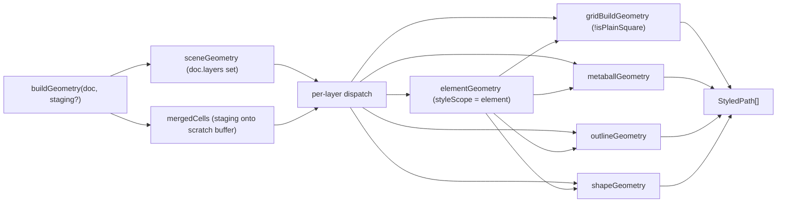

# Geometry — technical notes

## Scope

`buildGeometry(doc, staging?)` — the single pipeline turning a `Doc` (+ optional in-stroke
staging) into `StyledPath[]`, living in [`src/engine/geometry/`](../../src/engine/geometry/).
The folder owns the dispatch order, element-scope grouping, the square-grid pixel path, the
metaball field and the outline silhouette. Non-square lattices render through
[grids](grids.md) (`gridBuildGeometry`); the painted results are consumed by
[render-outputs](render-outputs.md) and the canvas stage. Committed pipeline context:
[render-pipeline](../architecture/render-pipeline.md).

## Module map

| File | Role |
|---|---|
| [`src/engine/geometry/index.ts`](../../src/engine/geometry/index.ts) | `buildGeometry` facade, `sceneGeometry` per-layer dispatch, `stagingPreview`/`stagedCellPath`, `metaballOverlayContours`, `PENDING_OBJ`, `distanceToLinkSq` |
| [`src/engine/geometry/types.ts`](../../src/engine/geometry/types.ts) | `StyledPath { d, fill?, stroke?, strokeWidth? }`, `Geometry`, `Staging` |
| [`src/engine/geometry/elements.ts`](../../src/engine/geometry/elements.ts) | `elementGeometry` — per-element grouping, `elementStyleKey` merge rule, unattributed bottom group |
| [`src/engine/geometry/shape.ts`](../../src/engine/geometry/shape.ts) | `shapeGeometry` — rect/run fragments, `roundedRectPath`, `mergedCells`, `borderRadii`, `fmt` |
| [`src/engine/geometry/metaball.ts`](../../src/engine/geometry/metaball.ts) | `metaballGeometry`, `metaballPreviewField` — square-grid kernel sources, per-color fields |
| [`src/engine/geometry/metaball-field.ts`](../../src/engine/geometry/metaball-field.ts) | `buildMetaballField` scalar field, `traceMetaballLoops`, `loopsToSmoothPath`, `metaballIso`, `kernelRadius` |
| [`src/engine/geometry/outline.ts`](../../src/engine/geometry/outline.ts) | `outlineGeometry` — exact cell-edge silhouette, `emitFilletPath`, fused corner-bridge webs |
| [`src/engine/geometry/marching-squares.ts`](../../src/engine/geometry/marching-squares.ts) | `marchingSquares(field, fw, fh, iso) → Pt[][]`; the shared `Pt` type |
| [`src/engine/geometry/poly-path.ts`](../../src/engine/geometry/poly-path.ts) | `filletPath`, `roundedPolygonPath`, `minCornerRun`, `fmt` — the tangent-fillet rounding core shared by the outline emitter, the grid renderer and cell forms |

## How it works

`buildGeometry` ([`src/engine/geometry/index.ts`](../../src/engine/geometry/index.ts)) dispatches in order:

1. Scene docs → `sceneGeometry`: per visible layer bottom → top, one pair of reused scratch
   buffers (each layer's paths are fully built before the next layer starts — this is what
   makes layers independent compositing spaces; metaballs/outlines never fuse across layers).
   Graph objects rasterize through `evalGraphMemo`; staged ink merges into the staged layer
   (`staging.layerId`, default topmost), staged erases route to each cell's composite owner
   (honest multi-layer move preview). Staged ink without an element id carries the sentinel
   `PENDING_OBJ` so it previews with document style.
2. Element scope (with attribution) → `elementGeometry`
   ([`src/engine/geometry/elements.ts`](../../src/engine/geometry/elements.ts)): group cells/links by owning
   element id, merge groups whose frozen styles share a key, then run the per-mode builders
   over each group's virtual doc.
3. Not a plain square grid → `gridBuildGeometry` (generic lattice path, [grids](grids.md)).
4. Else by `renderMode`: `metaballGeometry` / `outlineGeometry` / `shapeGeometry`.

**`shapeGeometry`** ([`src/engine/geometry/shape.ts`](../../src/engine/geometry/shape.ts)) scans the buffer row by row and
groups fragments per palette value into one compound `StyledPath` per color; connectors become
`M…L…` stroke paths with `doc.connectorWidth`. The **RLE fast path** merges horizontal
same-value runs into single rects when *all* hold: no texture, all radii 0, `sizeX === sizeY
=== 1`, square shape with rotation 0 and no angle jitter, `toneSize` off. Anything else
renders per-cell fragments (`cellShapeFragment` from [cell-shapes](grids.md) for non-square
forms; `toneSize` scales figures by tone with a per-value memo; size/angle jitter comes from
`effects/jitter.ts`). Baked texture holes are collected as `TextureCell`s and appended by the
[texture](texture.md) builders as evenodd subpaths of the same path.

**`metaballGeometry`** ([`src/engine/geometry/metaball.ts`](../../src/engine/geometry/metaball.ts)) builds kernel sources at
cell centers (plus junction kernels for corner connectivity, square grids only), turns every
link into a capsule, splats the shared scalar field, traces it at `metaball.iso` and emits
midpoint-quadratic smooth paths. `perColor` builds one field per palette value (sources and
capsules filtered by value); otherwise one merged field is filled with the dominant color.
`metaballPreviewField` (max side 480 field nodes) serves the diffusion-guides contour, traced
separately by `metaballOverlayContours` — overlay-only, global scope, never exported.

**`outlineGeometry`** ([`src/engine/geometry/outline.ts`](../../src/engine/geometry/outline.ts)) is covered in
[render-outputs](render-outputs.md).

**Staging preview.** `stagingPreview(doc, staging)` renders only the staged delta in
O(staged cells); each staged cell goes through `stagedCellPath` — the exact fragment
`shapeGeometry` would paint, exposed for incremental stroke layers. It returns `null`
(→ full `buildGeometry` fallback) when: no staged cells; not a plain square grid; the link
count changed (connector edits reshape every link); or the style in play is not "usable"
(`renderMode === 'pixels'` and `texture.effect === 'none'` — per element in element scope,
doc-level in global scope). That null matrix *is* the stroke-fallback cliff
([render-pipeline](../architecture/render-pipeline.md)).

## Data structures

- `Staging { cells?: Map<idx, value|null>, links?, objs?, palette?, layerId? }`
  ([`src/engine/geometry/types.ts`](../../src/engine/geometry/types.ts)) — the stroke-in-flight delta; `null` value
  = erase; `palette` lets staged values paint with colors that only join `doc.palette` at
  commit; `layerId` tags staged ink on scene docs.
- `StyledPath` — SVG path string + optional fill/stroke; the interchange format consumed by
  the canvas, PNG and SVG export alike ([render-outputs](render-outputs.md)).
- `MetaballField { f: Float32Array, fw, fh, scale }` — field node pitch `scale` converts node
  coordinates back to doc units at trace time.

## Algorithms

- **Metaball field** ([`src/engine/geometry/metaball-field.ts`](../../src/engine/geometry/metaball-field.ts)): one builder
  serves the square and non-square paths — sources (cell centers + corner junctions) and link
  capsules arrive in doc units, quality/preview resolution folds into the node `step`. Kernel:
  `t = 1−d²/R²; f += t^power`, `R = (0.815 + strength/100·0.44)/sub`; the falloff setting maps
  `tight|smooth|gooey` → power `3|2|1` (gooier = field reaches further, fatter merge). Trace
  runs at `metaball.iso` (clamped 0.2–0.8, default 0.5) with marching squares and
  midpoint-quadratic smoothing. `corner` connectivity adds kernels at diagonal junctions
  (square only); `squareEdges` mirrors the field at the canvas border so blobs lock onto it;
  the optional doc-unit `clip` zeroes nodes outside a region (radial passes the disc so blobs
  close along the canvas circle).
  Field side is capped at 360 nodes for the in-stroke preview vs 700 committed — the preview
  quality drop is intentional.
- **Marching squares** ([`src/engine/geometry/marching-squares.ts`](../../src/engine/geometry/marching-squares.ts)): 16-case
  segment table over a `Float32Array`; saddles resolved by center average; edge crossings
  linearly interpolated and shared through a lazy `Map<edgeId, Pt>` so adjacent cells
  reference the exact same coordinates; segments stitched into closed loops, open chains
  dropped. No rounding here — consumers fillet.
- **Tangent fillets** ([`src/engine/geometry/poly-path.ts`](../../src/engine/geometry/poly-path.ts)): `filletPath`
  is the one rounding core behind outline mode's `emitFilletPath`, the non-square grid's
  `roundedPolygonPath` and every polygonal cell form. Vertices turning less than ~10°
  (collinear splits, arc samples) pass through unrounded; each true corner gets a circular
  arc tangent to both edges — tangent length `t` clamped to half the whole edge run to the
  neighboring corners (arc samples included), arc radius `t/tan(θ/2)`. For 90° corners the
  radius equals `t`, so square-grid output is byte-identical to the pre-tangent emitter;
  hexagon/triangle/octagon corners lost their old tangent kinks (the rosette look). Chamfer
  keeps the same tangent points as a straight cut. Loops with one or two true corners (the
  radial half-disc wedges) round like any other — only corner-free loops (full-disc unions)
  emit plain polygons. `minCornerRun` measures a polygon's
  shortest true edge with those runs merged — it is the per-grid rounding base in
  [grids](grids.md).
- **Cell-form jitter** (`src/engine/effects/jitter.ts`): pixels-mode per-cell size/angle
  variation from two smooth value-noise samples over an 8-cell lattice (seeded,
  deterministic — neighbors correlate). Applied multiplicatively after tone scaling in both
  the square and grid pixel paths; any spread disables the RLE run merge and baked texture on
  that document (same gate family as `toneSize`). Zero spread = byte-identical rendering.
- **Element merge** ([`src/engine/geometry/elements.ts`](../../src/engine/geometry/elements.ts)): groups whose frozen styles
  are equal render as one group. Equality is the exact field list `sameElementStyle`
  compares, flattened into a string key cached per style object in a `WeakMap`
  (`elementStyleKey`) — O(ids) once instead of O(ids²) field compares per frame.
  `fuseObjects: false` appends the id to the key (Illustrator-style stacking instead of blob
  fusion). Unattributed cells render as one bottom group with the doc-level style so nothing
  ever disappears.

## Invariants & constraints

- Evenodd fill is contractual downstream ([ADR-0002](../decisions/0002-canvas2d-rendering-webgpu-deferred.md)):
  texture holes are subpaths; corner-bridge webs are fused into the silhouette loop itself
  (never a separate overlay path, whose area would cancel under evenodd).
- Scratch buffers are module-level and reused per frame (`sceneScratchCells/Objs`,
  `mergeScratch`, `mergeObjScratch`) — builders must fully consume a buffer before the next
  user.
- Coordinates are doc units: buffer (bx, by) → `x = bx/sub + (1/sub − sizeX/sub)/2`; path
  numbers rounded to 3 decimals (`fmt`).
- Staged erases on scene docs never invent a layer: they follow the composite owner recorded
  in `doc.cellObj`, so previews match what commit will do.

## Performance characteristics

- RLE path: `buildGeometry` −39 %…−99 % after PERFLOG M2a; runs test-pinned in
  [`src/engine/geometry/runs.test.ts`](../../src/engine/geometry/runs.test.ts).
- Whole-canvas rebuild 2048² ≈ 233 ms vs 6.3 ms for 4 dirty tiles
  ([`src/engine/geometry/tile-spike.bench.ts`](../../src/engine/geometry/tile-spike.bench.ts)) — the tile model is the
  declared next lever.
- Fallback costs per rAF frame during strokes: outline@2048² 722 ms, grain texture ≈ 1.7 s
  ([`src/engine/geometry/render-modes.bench.ts`](../../src/engine/geometry/render-modes.bench.ts); see [texture](texture.md)
  §Performance).
- Cell forms disable run merging: 512² at 50 % runs went 1.07 → 121.7 ms (×114) — decomposed
  in [`src/engine/geometry/style-decompose.bench.ts`](../../src/engine/geometry/style-decompose.bench.ts).
- Metaball is cheap at default strength (kernel radius ≈ 1 cell); per-color fields multiply
  the field pass by the number of palette values in play.

## Testing

- [`src/engine/geometry/geometry.test.ts`](../../src/engine/geometry/geometry.test.ts) — dispatch, staging preview, scene
  docs, serialization round trips (asserted through `buildSvg`).
- [`src/engine/geometry/runs.test.ts`](../../src/engine/geometry/runs.test.ts) — RLE run merging: merged and per-cell paths
  must agree for zero-radius pixel ink.
- [`src/engine/geometry/tone.test.ts`](../../src/engine/geometry/tone.test.ts) — tone-driven cell size (form halftone),
  including the staging preview.
- [`src/engine/geometry/marching-squares.test.ts`](../../src/engine/geometry/marching-squares.test.ts) — synthetic fields (discs)
  → closed loops.
- [`src/engine/geometry/metaball-field.test.ts`](../../src/engine/geometry/metaball-field.test.ts) — the shared field builder,
  square and grid paths, presets interplay.
- [`src/engine/geometry/outline.test.ts`](../../src/engine/geometry/outline.test.ts) — outline mode geometry and round trips.
- [`src/engine/geometry/corner-styles.test.ts`](../../src/engine/geometry/corner-styles.test.ts) — chamfer/arc corners,
  convex/concave outline radii, direction invariance.
- [`src/engine/geometry/connectivity.test.ts`](../../src/engine/geometry/connectivity.test.ts) — corner/bridge rendering
  (outline + metaball), serialization round trips, bridge junction symmetry.
- [`src/engine/perf-stress.test.ts`](../../src/engine/perf-stress.test.ts) — cost-ratio ratchets guarding the fast paths.

Benches: [`geometry.bench.ts`](../../src/engine/geometry/geometry.bench.ts),
[`render-modes.bench.ts`](../../src/engine/geometry/render-modes.bench.ts),
[`style-decompose.bench.ts`](../../src/engine/geometry/style-decompose.bench.ts),
[`tile-spike.bench.ts`](../../src/engine/geometry/tile-spike.bench.ts).

## Related decisions

- [ADR-0002](../decisions/0002-canvas2d-rendering-webgpu-deferred.md) — Canvas2D + path-string
  interchange.
- [ADR-0009](../decisions/0009-metaball-field-threshold-falloff.md) — one metaball field
  builder; threshold (iso) and falloff as product controls.

## OpenSpec capabilities

- `openspec/specs/pixel-styling/spec.md`, `openspec/specs/metaball-rendering/spec.md`,
  `openspec/specs/sub-cells/spec.md`

## Known limitations

- Whole-document rebuild per commit; per-tile caching is designed
  (`docs/research/performance.md` §4) but not implemented.
- `stagingPreview` covers only plain square pixel geometry — the largest remaining UX cliff
  for textured/outline documents.
- Metaball corner kernels exist only on square grids; non-square metaball fields splat cell
  centers only.
